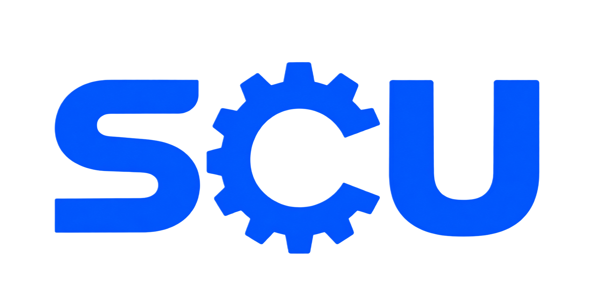
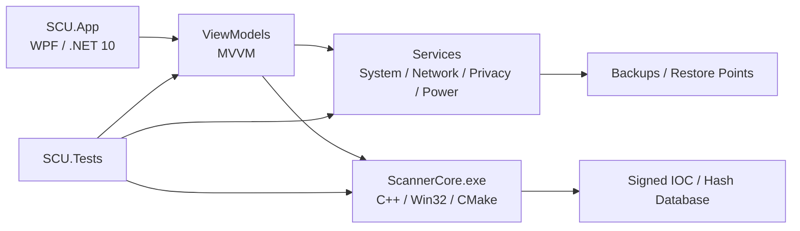

# SCU

[](https://www.virustotal.com/gui/url/333ded8049c8a1599af1b3981d68845ab1bd8ea9a92f3c93f2d6d3af8a0e9aa6?nocache=1)

<p align="center">
  
</p>

<p align="center">
  <strong>Safecleanup</strong><br>
  Современный набор инструментов для настройки, обслуживания и диагностики Windows.
</p>

<p align="center">
  <a href="#возможности">Возможности</a> ·
  <a href="#архитектура">Архитектура</a> ·
  <a href="#сборка">Сборка</a> ·
  <a href="#безопасность">Безопасность</a> ·
  <a href="#лицензия">Лицензия</a>
</p>

<p align="center">
  
  
  
  
  
</p>

---

## О проекте

**SCU (Safecleanup)** — desktop-приложение для Windows, которое объединяет в одном интерфейсе инструменты, обычно разбросанные по системным настройкам, классической панели управления и сторонним утилитам.

Проект построен вокруг нескольких принципов:

- **один интерфейс вместо десятков системных окон;**
- **явные подтверждения перед потенциально опасными изменениями;**
- **резервное копирование и точки восстановления там, где это уместно;**
- **локальная работа без обязательного resident-сервиса;**
- **отдельный security scanner с fail-closed проверками целостности;**
- **тёмная и светлая темы;**
- **русский и английский интерфейсы.**

SCU подходит как для повседневного обслуживания собственного ПК, так и как база для дальнейшей разработки специализированных Windows-инструментов.

## Возможности

### 🖥️ Обзор и диагностика

- Дашборд состояния системы.
- Сводная информация о Windows и оборудовании.
- История операций и изменений.
- Системный benchmark.
- Рекомендации по обслуживанию.

### 🧹 Очистка и обслуживание

- Очистка временных файлов и системного мусора.
- Работа с компонентами Windows.
- Поиск проблем и проверка целостности.
- Удаление нежелательных приложений.
- Управление пользовательскими сценариями.

### 🔐 Приватность и безопасность

- Настройки приватности и телеметрии.
- Управление UAC.
- On-demand сканирование файлов.
- Изолированный `ScannerCore.exe`.
- Поддержка подписанной базы IOC/hash-сигнатур.
- Quarantine/workflow для обнаруженных объектов.

### ⚙️ Управление Windows

- Службы Windows.
- Автозагрузка.
- Задачи планировщика.
- Обновления Windows.
- Установленные приложения.
- Питание, память и CPU.
- Системные параметры и поведение интерфейса.

### 🌐 Сеть, ввод и браузер

- Настройка сетевых параметров.
- Профили сетевых адаптеров.
- Параметры ввода.
- Настройки браузера.
- Встроенный browser workflow на базе WebView2.

### 🎨 Интерфейс

- Dark / Light theme.
- RU / EN localization.
- Навигация по секциям без открытия множества окон.
- Поиск по настройкам.
- Уведомления и контролируемые confirmation dialogs.
- Поддержка accessibility-имен для элементов управления.

---

## Архитектура

Проект разделён на пользовательское приложение, security scanner и тестовый контур.



### Основной стек

| Компонент | Технология |
|---|---|
| Desktop UI | WPF |
| Основной язык | C# |
| Runtime | .NET 10 |
| Архитектура UI | MVVM |
| MVVM toolkit | CommunityToolkit.Mvvm |
| Browser | Microsoft WebView2 |
| System APIs | .NET / Win32 / WMI / Registry |
| Security scanner | C++ / Win32 |
| Scanner build | CMake |
| Installer | Inno Setup |
| Release signing | Windows SignTool |
| Target | Windows x64 |

---

## Структура проекта

```text
SCU/
├── SCU.App/
│   ├── Common/             # общие компоненты, безопасность, темы, локализация
│   ├── Interop/            # Win32 и запуск внешних процессов
│   ├── Models/             # модели данных
│   ├── Services/           # системные сервисы и бизнес-логика
│   ├── ViewModels/         # MVVM ViewModels
│   ├── Views/
│   │   ├── Sections/       # основные разделы приложения
│   │   └── Controls/       # переиспользуемые WPF-контролы
│   ├── Themes/             # темы и стили
│   └── Assets/              # ресурсы приложения
│
├── SecurityScanner/
│   ├── src/                # C++ scanner
│   ├── database/           # security database
│   ├── tools/              # build/update/test tooling
│   └── signing/            # локальные signing metadata
│
├── SCU.Tests/              # тесты (проект указан в SCU.sln)
├── build-release.ps1       # release pipeline
├── setup.iss               # Inno Setup installer
└── SCU.sln                 # Visual Studio solution
```

---

## Безопасность

Security scanner разработан как **on-demand компонент**, а не как постоянно работающий resident-сервис.

Ключевые механизмы:

- `ScannerCore.exe` запускается только для выполнения операции сканирования.
- Предусмотрена проверка целостности бинарника через **certificate thumbprint pinning**.
- Несовпадение ожидаемого отпечатка приводит к отказу (`fail-closed`).
- База сигнатур имеет строгую валидацию формата.
- Поддерживается подписанный пакет обновления базы.
- Для archive targets предусмотрено отдельное сканирование содержимого.
- Кэш вердиктов привязан к версии движка, базы и профилю сканирования.
- Повреждённые или некорректные записи кэша игнорируются.
- Приватные ключи подписи не должны храниться в репозитории.

> **Важно:** SCU не заменяет Microsoft Defender или другой основной endpoint security продукт. ScannerCore предназначен для on-demand проверок и сосуществует с системной защитой Windows.

Подробнее о scanner: [`SecurityScanner/README.md`](SecurityScanner/README.md).

---

## Резервирование изменений

Для операций, способных изменить состояние системы, проект использует защитные механизмы, включая:

- backup текущих настроек;
- точки восстановления Windows там, где это поддерживается сценарием;
- явные confirmation dialogs;
- проверки границ путей перед файловыми операциями;
- контролируемое удаление приложений и их данных;
- ведение истории операций.

Это позволяет отделить обычные диагностические операции от действий, которые действительно меняют систему.

---

## Установка

Для конечного пользователя рекомендуется использовать готовый installer из раздела **Releases** репозитория.

SCU рассчитан на:

- **Windows x64**
- современную Windows 10/11-среду;
- административные права для операций, которые требуют изменения системного состояния.

> Само приложение собирается как self-contained publish, поэтому отдельная установка .NET Runtime для release-сборки не требуется.

---

## Сборка

### Требования

Для разработки понадобятся:

- Windows x64;
- Visual Studio 2022 с workload для .NET desktop development;
- .NET 10 SDK;
- CMake;
- Windows SDK / `signtool.exe` — только для signing;
- Inno Setup 6 — только для создания installer.

### 1. ScannerCore

```powershell
cmake -S SecurityScanner -B SecurityScanner/build -A x64
cmake --build SecurityScanner/build --config Release
```

Результат:

```text
SecurityScanner/out/Release/ScannerCore.exe
```

### 2. Приложение

```powershell
dotnet restore SCU.sln

dotnet build SCU.sln -c Release -p:Platform=x64
```

### 3. Publish

```powershell
dotnet publish SCU.App/SCU.App.csproj `
  -c Release `
  -r win-x64 `
  --self-contained true `
  -p:PublishSingleFile=true `
  -p:PublishReadyToRun=true `
  -p:IncludeNativeLibrariesForSelfExtract=true `
  -p:EnableCompressionInSingleFile=true `
  -o publish
```

### 4. Полный release pipeline

В репозитории есть готовый PowerShell pipeline:

```powershell
powershell -File build-release.ps1
```

Полезные варианты:

```powershell
# только publish
powershell -File build-release.ps1 -SkipInstaller

# publish без signing
powershell -File build-release.ps1 -SkipSign
```

Пароль PFX передаётся через окружение:

```powershell
$env:SCU_PFX_PASSWORD = "..."
powershell -File build-release.ps1
```

Скрипт последовательно:

1. собирает `ScannerCore`;
2. публикует `SCU.App`;
3. проверяет наличие обязательных runtime-файлов;
4. подписывает бинарники при включённом signing;
5. собирает Inno Setup installer;
6. проверяет подписи;
7. формирует `SHA256SUMS.txt`.

---

## Тестирование

Основной тестовый проект:

```powershell
dotnet test SCU.Tests
```

Security scanner также предусматривает сценарии для:

- EICAR;
- ZIP/archive scanning;
- scripts;
- persistence;
- проверки certificate pinning;
- отмены операций;
- повреждённой базы;
- regression/security cases.

Для clean-corpus проверки используются скрипты из:

```text
SecurityScanner/tools/corpus/
```

---

## Принципы разработки

SCU старается держать системные операции максимально предсказуемыми:

- сначала проверка входных данных, затем изменение состояния;
- fail-closed для security-critical проверок;
- минимум скрытых фоновых действий;
- отдельные сервисы вместо системной логики в code-behind;
- повторное использование общих механизмов подтверждения, логирования и резервирования;
- отсутствие секретов и приватных ключей в исходниках;
- воспроизводимая release-цепочка.

---

## Для разработчиков

Если вы хотите добавить новый системный раздел:

1. Создайте модель состояния / сервис в `SCU.App/Services`.
2. Добавьте ViewModel.
3. Создайте `Views/Sections/<Name>View.xaml`.
4. Подключите View в `MainWindow.xaml.cs`.
5. Добавьте локализацию и accessibility-метаданные.
6. Для операций, меняющих систему, добавьте подтверждение и backup/restore workflow.
7. Покройте критическую логику тестами.

Для security-sensitive кода предпочтительны явные проверки, ограниченные области действия и fail-closed поведение.

---

## Лицензия

Проект распространяется согласно файлу [`LICENSE`](LICENSE).

---

<p align="center">
  <sub>SCU — Safecleanup</sub><br>
  <sub>Windows system tools without the clutter.</sub>
</p>
